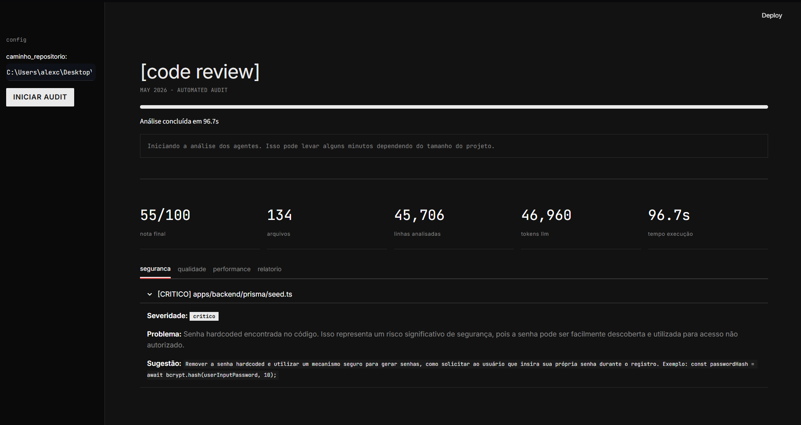
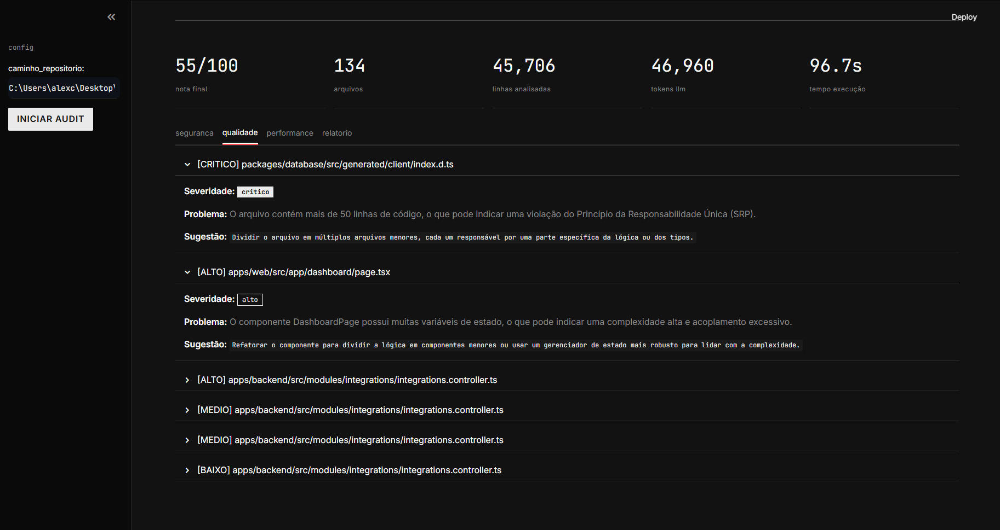

# [code review agent]

> Automated, AI-driven code auditing orchestrated by LangGraph.


*(DICA: Salve o seu print principal com o nome `hero.png` na raiz do projeto)*

O **Code Review Agent** é uma ferramenta de auditoria de código baseada em grafos que analisa repositórios inteiros em busca de problemas de segurança, qualidade e performance. Construído com **LangGraph** para orquestração de múltiplos agentes autônomos e **Streamlit** para uma interface de usuário com estética editorial e brutalista.

## ⚙️ Como Funciona

A arquitetura utiliza um grafo de estado (State Graph) onde o contexto do repositório flui através de agentes especialistas:

1. **Orchestrator**: Varre o repositório local, ignora arquivos irrelevantes (`node_modules`, `.git`, etc) e prepara os blocos de código para análise.
2. **Security Agent**: Analisa vulnerabilidades, credenciais hardcoded, injeções e falhas OWASP.
3. **Quality Agent**: Avalia aderência ao SOLID, acoplamento, duplicação de código e complexidade ciclomática.
4. **Performance Agent**: Identifica gargalos, loops ineficientes e problemas de gerenciamento de estado/memória.
5. **Reporter Agent**: Consolida as métricas, calcula o score final (0-100) e contabiliza o uso exato de tokens LLM para controle de custos (FinOps).


*(DICA: Salve o seu print da aba Qualidade com os expanders abertos como `issues.png` na raiz do projeto)*

## 🚀 Tecnologias

- **Python 3.10+**
- **LangGraph & LangChain**: Orquestração de workflows de IA.
- **OpenAI (GPT-4o-mini)**: Motor de raciocínio lógico e revisão de código.
- **Streamlit**: Interface web (profundamente customizada com CSS injetado para visual monocromático de terminal).

## 🛠️ Instalação e Uso

1. Clone o repositório:
```bash
git clone https://github.com/seu-usuario/code-review-agent.git
cd code-review-agent
```

2. Crie um ambiente virtual e instale as dependências:
```bash
python -m venv venv
source venv/bin/activate  # ou venv\Scripts\activate no Windows
pip install langchain langgraph openai streamlit rich python-dotenv
```

3. Configure sua chave da API da OpenAI criando um arquivo `.env` na raiz:
```env
OPENAI_API_KEY=sk-sua-chave-aqui
```

4. Inicie o dashboard web:
```bash
python -m streamlit run app.py
```

## 📊 FinOps (Token Tracking)

Para viabilizar o uso em ambientes corporativos, o estado global do grafo rastreia recursivamente o `token_usage` da API da OpenAI. Ao final da execução, o dashboard exibe exatamente quantos tokens foram consumidos por toda a malha de agentes, permitindo calcular o custo exato de cada auditoria.

---
*Desenvolvido como projeto de exploração de Inteligência Artificial e Agentes Autônomos - May 2026.*
